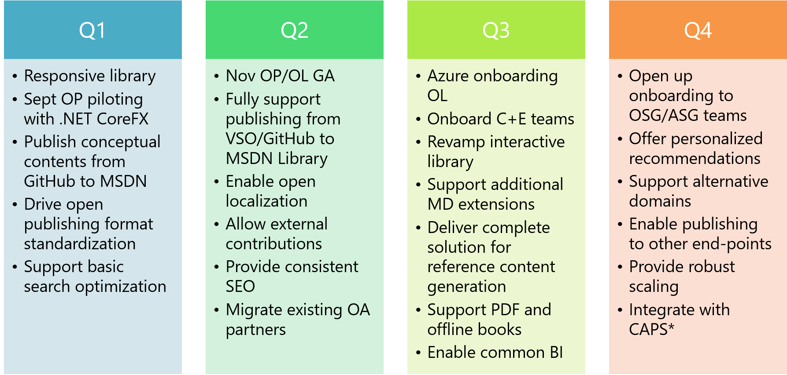

Open Publishing Introduction
=================================

1. Definition
-------------

Open Publishing (OP) is a set of content services accessible through open standard-based interfaces such as GIT.

Our legacy documentation processes and tools are not designed for services
- Document releases are moving years/months to weeks/days
- Technical documents are shifting from large size to small, hierarchical to flat, from static to interactive
- Engineering (and external communities) should be able to directly contribute to content creation/feedback
- Engineering prefers to use the same process for code and docs
- Product teams are hosting increasingly more docs on their own websites
- Without common tools, many teams are building their own

The end result is that we have a lot of fragmentation in processes, tools and environments. 

On the other side, many content publishing scenarios and requirements are the same. 

Although different teams may have different workflows, if we can open up the content pipeline piece by piece, they can still share those essential common blocks. By enabling open publishing services, there would be several key benefits
- Decoupling of content creation and distribution
- Continuous integration
- Open contribution and connected feedback
- Flexible hosting
- Centralized analytics

There would be four core services in Open Publishing
- Reference content auto-generation
- Content publishing
- Localization
- BI

Open publishing service would be internally open sourced, to allow other teams to contribute to our codebase in future.

2. Major Scenarios
------------------

Standardized interface and agile tooling
- Git and Markdown (as well as HTML) are commonly accepted interface and format both internally and externally
- Plenty of additional tools available for different teams to choose according to their existing process and usage

Available and accessible for all
- Internally - product team as well as traditional content team
- Externally - open to third party community for contribution

Different types of documentation
- Conctptual content for getting started, tutorials, etc.
- Reference content for API

Multiple toolchains
- CAPS
- Git, including GitHub and VSO

Multipe hosting environments
- MSDN
- Custom domain support

Content management as a service
- Self-managed, flexible content workflow, from provisioning, authoring, staging, reviewing to publishing
- Integrated localization service, get your content localized and published easily
- Connected BI service, established feedback loop and customizable analytics from content creator to consumers (comming soon)
- Consistent SEO approach

3. Service Architecture
-----------------------

4. Roadmap
----------
