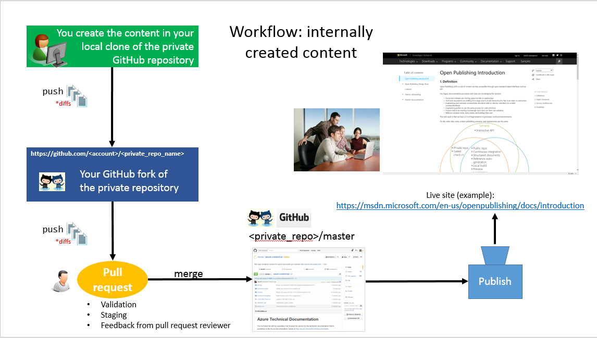
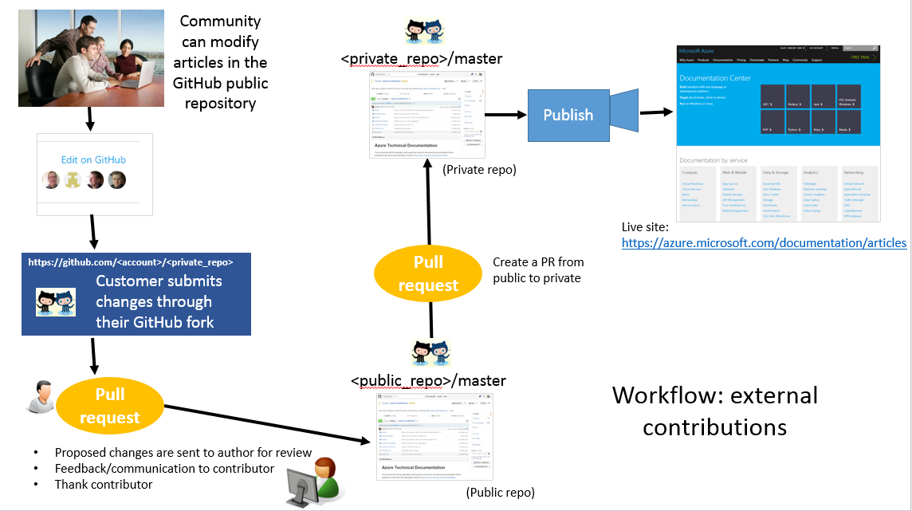

# Creating the repo #
It is the content owner responsibility to create the GIT repo and provide the right permissions to the users to access to them. 

For GIT repo, we currently plan to support both GitHub and Visual Studio Online.

If you are not familiar with GitHub, check out our summary of the [GitHub terminology](GitHub-terminology.md) for basic terminology used through this documentaiton.
## Repo creation ##

The first step is to create a GIT repository and setup it up as an open publishing repo.

- For GitHub repository setup, follow the [GitHub tutorials](https://help.github.com/articles/set-up-git/). 
- For Visual Studio Online see (TBD).

### GitHub Private vs. public repo ###

If you do not want/need external contributions (i.e. external to Microsoft), create a private repo.
If you want/need external contributions (i.e. external to Microsoft), then you need to create two repos: one public and one private.

- The private repo will contain the under development content, that is, the content that your customers cannot see yet. 
- The public repo will contain the content that is widely available and, hence, your customers can contribute to. Note that even you have not publish live your content, as long as it is in your public repo, external people can access it. 

You need to manually synchronize your private repo to your public repo whenever you are ready to make the content available to your customers. This is a method of how Azure does it:  

- Pull the changes made in the public repo into a local branch of the private repo. 
- Fix any merge conflicts and submit a pull request to the master branch in the private repo. 
- Once the pull request passes validation, merge it to the master branch in the private repo. 
- Repeat the process for the public repo and once the repos are synced, you can publish the content.
 
As Open Publishing offers local preview, you can always pull changes from the public repo to your private repo to have a full view of your content. 

The following two images show a graphical view of the recommended workflow. Note this is only added here for your reference. Original images were taken from Azure GitHub training from Tyson Nevil.

#### Internal contributions only workflow ####

#### External contributions workflow #### 

## Set up permissions to the GIT repo
For permission to access the content repo, the content owner is responsible for leveraging GITHUB permission system, and give certain people read or write permission to the repo. Our recommendation is you create an org and host the repo under that org, then add people to that org to give them write permission.

Users are always able to publish by pushing a change to a branch, as long as he has the push permission to the repo.

# Next steps #
The next steps the team will do is to do the [Repo and provisioning](repo-provision.md). Thus, we need the following information:

- Repo URLs
- Publishing end-points: MSDN, TechNet, VS.com, other. If other, we need the canonical URL you would like to have.